在上一节，我们知道了动态数组实现的大概原理，不过，动态数组却有一个明显的缺点，即**可能会造成内存空间的大量浪费**。因为当动态数组空间使用完以后，会申请一个更大的空间，用来保存数据，但是更大空间的数组，却不一定能全部使用，因此可能造成空间浪费。

# 1. 链表

> **链表**是一种**链式存储**的线性表，所有元素的内存地址不一定是连续的；

例如我们添加一个元素，会首先为则个元素分配存储空间，并且在链表中存储数据，会首先创建出一个node节点对象，其中内部会有一块存储空间，用来保存要存储的数据，例如下图是一个节点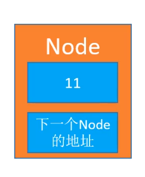

假设有两个节点对象，则如下图所示进行关联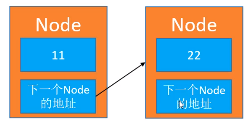

以此类推，当有多个节点时，会像下图一样相互关联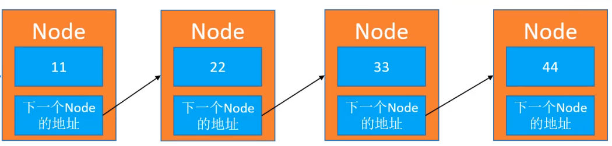

所以，由于每次添加一个元素，都是新分配的内存空间，说一每个节点之间的内存地址并不一定是连续的。

当某个节点是尾节点时，尾节点的下一个Node地址将指向null，用图形表示如下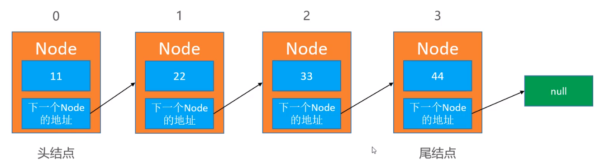

# 2. 链表的设计

链表中应该包含的元素

1. size - 保持链表的大小
2. first - 指向链表的头节点


一个完整的链表，用图形表示如下

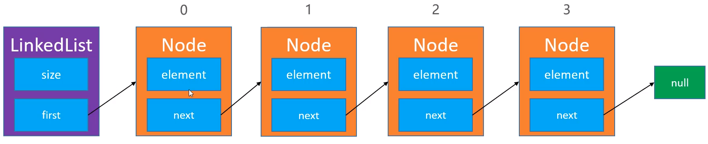

了解了链表的设计以后，我们就可以来了解一下链表的接口设计了。

# 3. 链表的接口设计

由于**链表和动态数组都是线性表**，因此链表的大部分接口和动态数组是一致的，但实现方式不一样。因此我们可以将链表和动态数组的接口统一申明到接口文件中，关系如下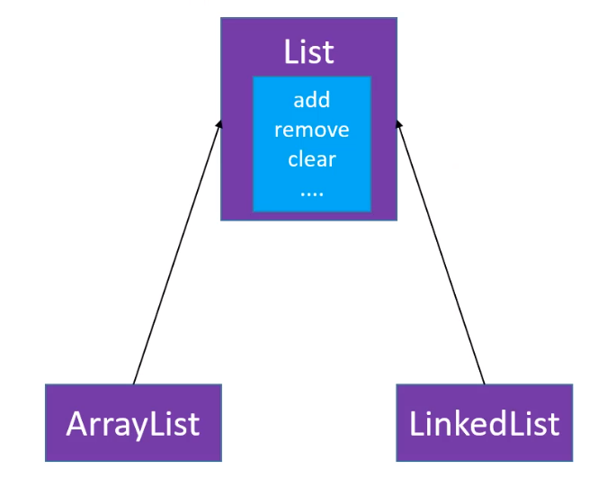

由于在动态数组与链表之间，存在一些接口的实现和一些相同的方法，因此可以抽取一个抽象类与一个接口，来管理接口与方法的实现，因此有了如下的设计

至此，链表的接口设计就完成了，接下来再来了解一下接口的实现

# 4. 清空链表 - clear()

首先，我们假设现在有一个结构如下的链表对象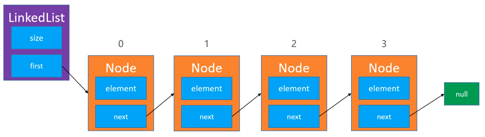

我们需要做的事情就是

1. 将size设置为0
2. 将`LinkedList`对象中的first字段设置为null，当我们将first设置为null时，相当于头节点没有引用指向它，头节点的内存就会被系统回收，然后后节点依次被系统销毁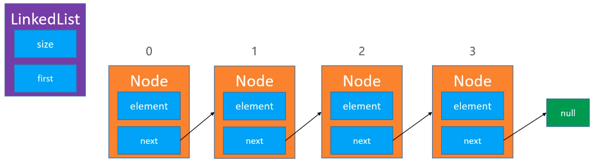

# 5. 添加节点 - add(int index, E element)

假设现在有如下的链表，需要往Node节点为1的位置添加一个值为44新的Node节点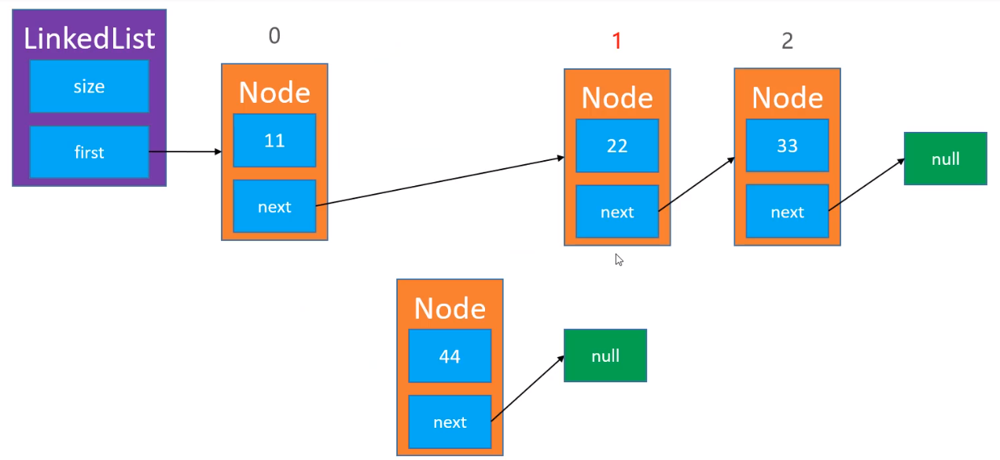

> 操作步骤如下

1. 将新节点的next指向Node为1的节点
2. 然后再让Node为1节点前面的节点里面的next指向新的节点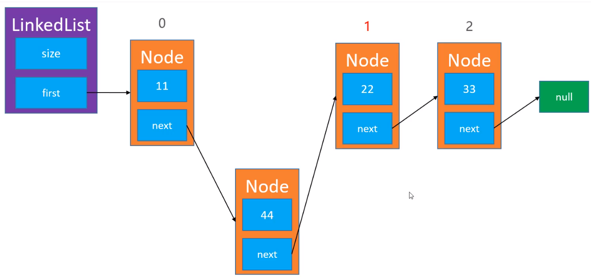
3. 最后更新索引，就完成了节点的添加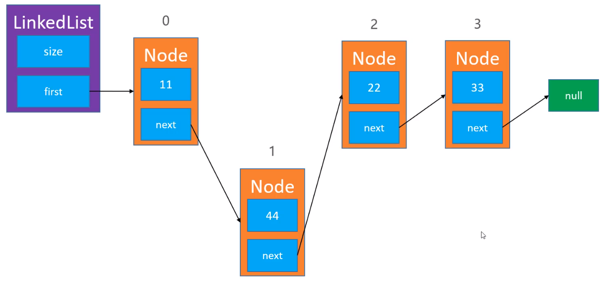

不过需要注意的是，再添加元素时，要特殊处理0的位置

```java
/***
 * 在index位置插入一个元素
 * @param index 插入的元素位置
 * @param element 插入的元素
 */
@Override
public void add(int index, E element) {
    System.out.println("index == "+index);
    if (index == 0) {
		// 注意边界
        first = new Node <E>(element, first);
    } else {
        Node <E> prev = node(index-1);
        prev.next = new Node <>(element, prev.next);
    }

    size++;
}
```


> 编写链表的过程中，要注意边界测试，如index = 0、size - 1、size时

# 6. 删除元素 - remove(int index)

假设有以下一个链表对象，其中我们要删除Node为1的节点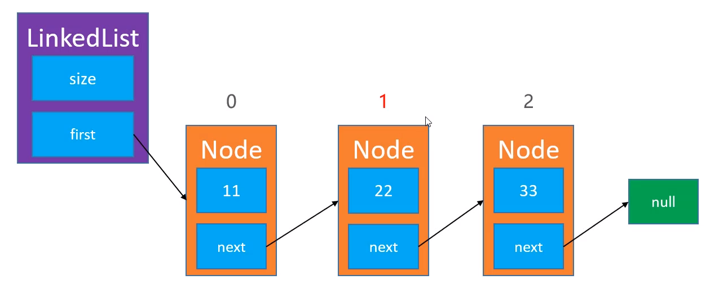


操作方法非常简单，我们只需要将Node为0节点中的next指向其下下个节点即可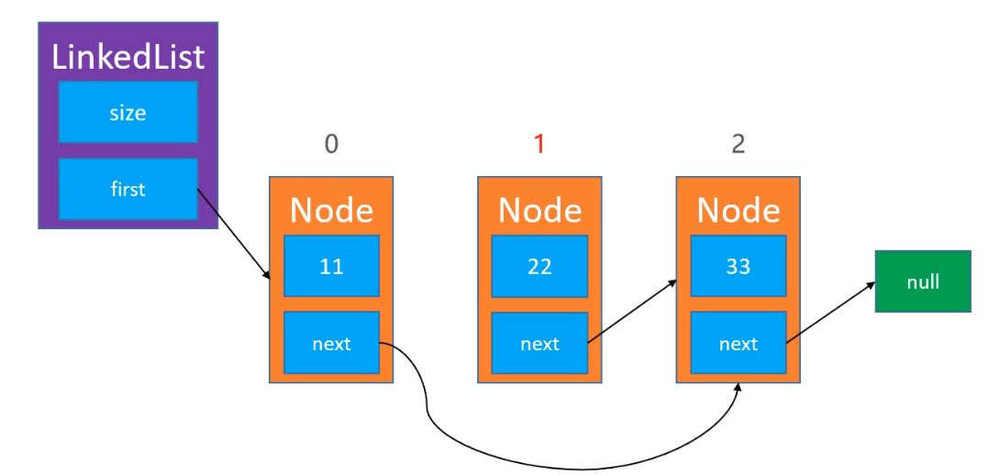

修改Node为0的next指向后，Node为1的节点没有引用指向他，其内存就会被系统回收掉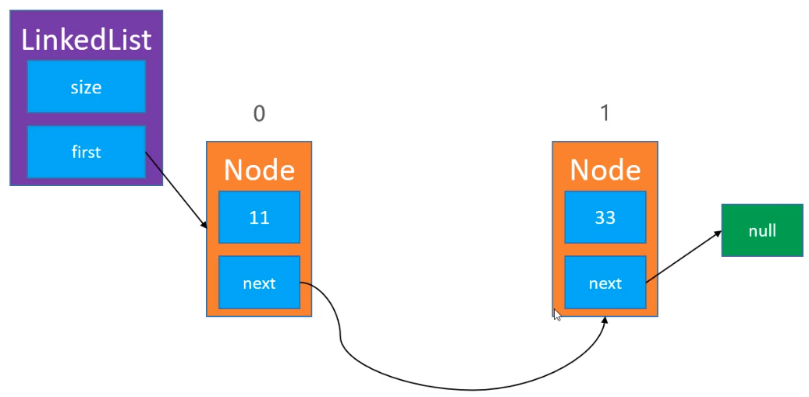

> 删除节点具体步骤

1. 找到被删除节点的前一个节点
2. 将前一个节点中的next赋值为下被删除节点的next即可

好工具分享-推荐一个神奇的网站给大家 [数据结构和算法动态可视化](https://visualgo.net/zh) ，又兴趣的读者可以去看看，非常推荐

链表练习题 - 题目来自leetcode

[题目1 删除链表中的节点](https://leetcode-cn.com/problems/delete-node-in-a-linked-list/)

[题目2 反转一个链表](https://leetcode-cn.com/problems/reverse-linked-list/) [题目解析](./%E5%8D%95%E5%90%91%E9%93%BE%E8%A1%A8%E7%BB%83%E4%B9%A0%E9%A2%98%E8%A7%A3%E6%9E%90.md)

[题目3 判断一个链表是否有环](https://leetcode-cn.com/problems/linked-list-cycle/) [题目解析](./%E5%8D%95%E5%90%91%E9%93%BE%E8%A1%A8%E7%BB%83%E4%B9%A0%E9%A2%98%E8%A7%A3%E6%9E%90.md)