# 1. 队列

> **队列**是一种特殊的线性表，只能在**头尾两端**进行操作

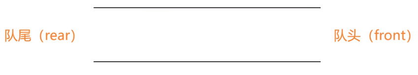

## 1.1 入队

队尾(rear)：只能从**队尾添加**元素，一般叫做**enQueue**,**入队**

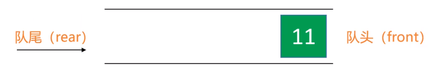

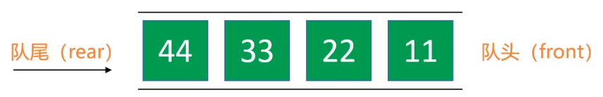

## 1.2 出队

队头(front)：只能从**队头移除**元素，一般叫做**deQueue**,**出队**


> 入队出队原则：先进先出原则，First In First Out ，FIFO

在生活中常常也使用到队列，比如我们经常遇到的排队。


# 2. 队列的接口设计


```java
int size(); // 元素的数量
boolean isEmpty(); // 是否为空
void enQueue(E element); // 入队
E deQueue(); //出队
E front(); //获取队列的头元素
void clear(); // 清空
```

同样的，队列同样可以使用我们前面介绍的数据结构来实现。如动态数组，链表等。

不过这里优先使用**双向链表**来实现，因为队列主要是往**头尾**操作元素。

# 3. 队列的实现

同样的，我们可以使用实现栈的方式来实现队列，实现代码如下：

```java
/**
 * 队列
 */
public class Queue<E> {

    private List <E> list = new LinkedList <>();

    /**
     * 元素的数量
     *
     * @return
     */
    public int size() {
        return list.size();
    }

    /**
     * 是否为空
     *
     * @return
     */
    public boolean isEmpty() {
        return list.isEmpty();
    }

    /**
     * 入队
     *
     * @param element
     */
    public void enQueue(E element) {
        list.add(element);
    }

    /**
     * 出队
     *
     * @return
     */
    public E deQueue() {
        return list.remove(0);
    }

    /**
     * 获取队列的头元素
     *
     * @return
     */
    public E front() {
        return list.get(0);
    }

    /**
     * 清空
     */
    public void clear() {
        list.clear();
    }
}

```

# 4. 练习 - 用栈实现队列

前面已经了解了队列的实现方式，因此可以通过LeetCode上的练习题，来加深印象，[用栈实现队列](https://leetcode-cn.com/problems/implement-queue-using-stacks/)

解题思路

准备两个栈：inStack，outStack

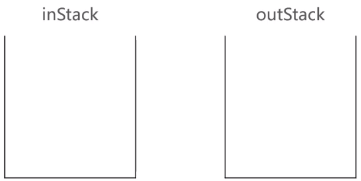

入队时，push到inStack中

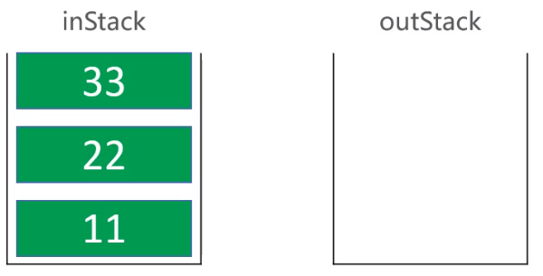

出队时

1.如果outStack为空，将inStack所有元素，逐一弹出，push到outStack，outStack弹出栈顶元素

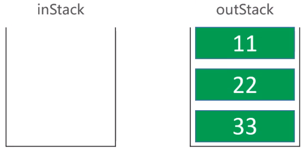

再弹出outStack中的栈顶元素


2.如果outStack不为空，outStack弹出栈顶元素

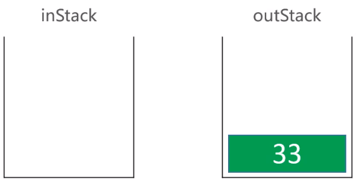

假设以下操作：11入队，22入队，出队，33入队，出队

准备两个stack

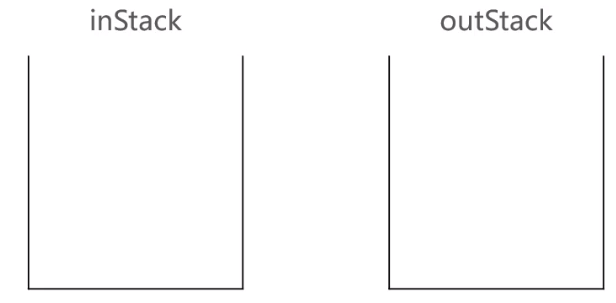

先将11,22入队

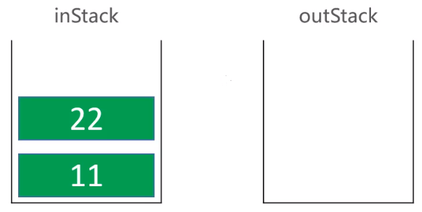

出队，将inStack push到outStack当中，然后弹出outStack的栈顶元素

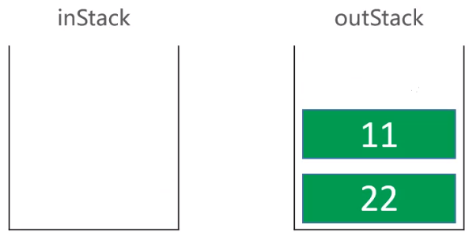

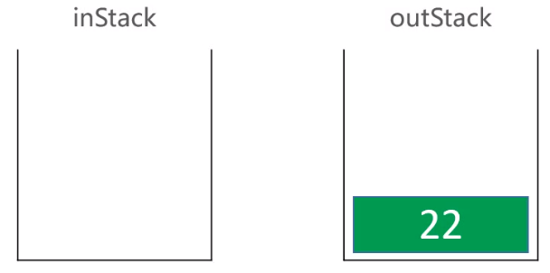

33入队

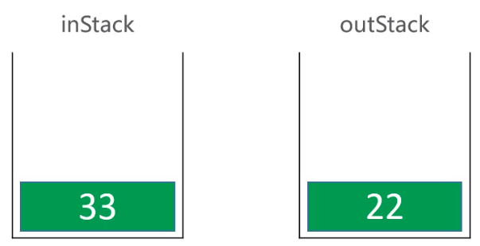

出队，直接从outStack中弹出

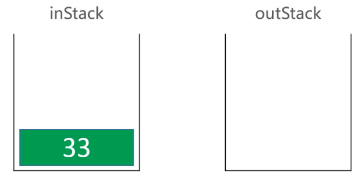

[解题源码在这里](https://github.com/MSTGit/Algorithm/tree/master/LeetCode)

# 5. 双端队列(Deque)

> **双端队列**(Double ended queue)是能在头尾两端**添加**，**删除**的队列

可以从队尾入队

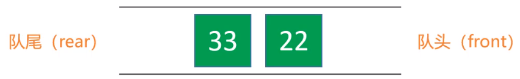

也可以从队头入队

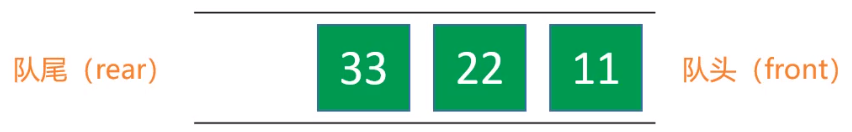

又从队尾入队

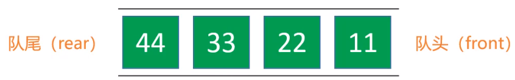

再从对头出队

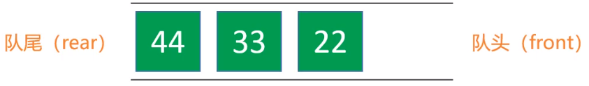

## 5.1 双端队列的接口设计


```java
int size(); // 元素的数量
boolean isEmpty(); //是否为空
void enQueueRear(E element); //从队尾入队
E deQueueFront(); //从队头出队
void enQueueFront(E element); //从队头入队
E deQueueRear(); //从队尾出队
E front(); //获取队列的头元素
E rear(); //获取队列的尾元素

```

## 5.2 双端队列的实现

```java

/**
 * 双端队列
 */
public class Deque<E> {
    private List <E> list = new LinkedList <>();

    /**
     * 元素的数量
     * @return
     */
    public int size() {
        return list.size();
    }

    /**
     * 是否为空
     * @return
     */
    public boolean isEmpty() {
        return list.isEmpty();
    }

    /**
     * 从队尾入队
     * @param element
     */
    public void enQueueRear(E element) {
        list.add(element);
    }

    /**
     * 从队头出队
     * @return
     */
    public E deQueueFront() {
        return list.remove(0);
    }

    /**
     * 从队头入队
     * @param element
     */
    public void enQueueFront(E element) {
        list.add(0,element);
    }

    /**
     * 从队尾出队
     * @return
     */
    public E deQueueRear() {
        return list.remove(list.size() - 1);
    }

    /**
     * 获取队列的头元素
     * @return
     */
    public E front() {
        return list.get(0);
    }

    /**
     * 获取队列的尾元素
     * @return
     */
    public E Rear() {
        return list.get(list.size() - 1);
    }
}
```

# 6. 循环队列(Circle Queue)

> 循环队列底层用数组实现 

循环队列类似于第5讲中介绍的**静态链表**

定义一个数组，并定义一个front成员变量，该成员变量保存这对头元素的下表，如

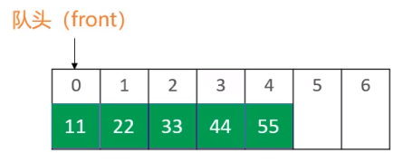

假设进行出队操作，者现在把队头元素删除掉

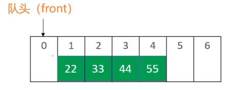

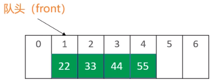

这里的操作步骤与静态链表的逻辑相同，该地方就不赘述了。

## 6.1 循环队列的扩容

1.申请一块更大的存储空间，然后将原来内存中的元素，依次存放到新的存储空间中

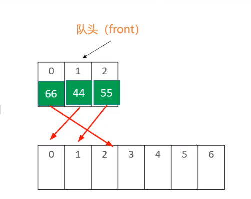

2.将对头(front)清0

循环队列实现源码

```java

/**
 * 循环队列
 */
@SuppressWarnings("unchecked")
public class CircleQueue<E> {
    /**
     * 存储队头元素的下标
     */
    private int front;

    /**
     * 存储所有元素的大小
     */
    private int size;

    /**
     * 元素数组
     */
    private E[] elements;

    /**
     * 默认初始化大小
     */
    private static final int DEFAULT_CAPACITY = 10;

    public CircleQueue() {
        elements = (E[]) new Object[DEFAULT_CAPACITY];
    }

    /**
     * 元素的数量
     *
     * @return
     */
    public int size() {
        return size;
    }

    /**
     * 是否为空
     *
     * @return
     */
    public boolean isEmpty() {
        return size == 0;
    }

    /**
     * 入队
     *
     * @param element
     */
    public void enQueue(E element) {
        ensureCapacity(size+1);
        elements[index(size)] = element;
        size++;
    }

    /**
     * 出队
     *
     * @return
     */
    public E deQueue() {
        E frontElement = elements[front];
        elements[front] = null;
        front = index(1);
        size--;
        return frontElement;
    }

    /**
     * 获取队头元素
     *
     * @return
     */
    public E front() {
        return elements[front];
    }

    /**
     * 自定义打印
     *
     * @return
     */
    @Override
    public String toString() {
        StringBuilder sb = new StringBuilder();
        sb.append("capcacity=").append(elements.length).append(" size=").append(size).append(" front=").append(front).append(", [");
        for (int i = 0; i < elements.length; i++) {
            if (i != 0) {
                sb.append(",");
            }
            sb.append(elements[i]);
        }
        sb.append("]");
        return sb.toString();
    }

    /**
     * 转换索引(例如队头元素[0]，不一定位于数组的[0]下标，这里进行一次转换)
     *
     * @param index
     * @return
     */
    private int index(int index) {
        index += front;
        return index-(index >= elements.length ? elements.length : 0);
    }

    /**
     * 数组扩容 保证要有capacity的容量
     *
     * @param capacity
     */
    private void ensureCapacity(int capacity) {
        int oldCapacity = elements.length;
        if (oldCapacity < capacity) {
            //确定新的容量  新容量为旧容量的1.5倍
            int newCapacity = oldCapacity+(oldCapacity >> 1);
            //创建一个更大存储空间的数组
            E[] newElements = (E[]) new Object[newCapacity];
            //将原来数组中的元素，复制到新的数组中
            for (int i = 0; i < size; i++) {
                //获取数组中的真实索引
                newElements[i] = elements[index(i)];
            }
            elements = newElements;
            front = 0;
        }
    }
}

```


# 7. 循环双端队列

> 循环双端队列：可以进行两端添加，删除操作的循环队列

相当于双端队列于循环队列的结合体，因此很多逻辑与循环队列相似，其中又区别的是

从头部入队，假设现有如下的队列，


我们要在下标尾1的地方添加新元素

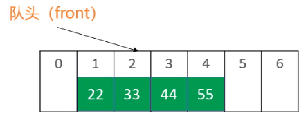

最后更新队头(front)的值即可

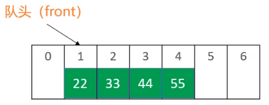

循环双端队列实现源码

```java
/**
 * 循环双端队列
 */
@SuppressWarnings("unchecked")
public class CircleDeque<E> {
    /**
     * 存储队头元素的下标
     */
    private              int front;
    /**
     * 存储所有元素的大小
     */
    private              int size;
    /**
     * 元素数组
     */
    private              E[] elements;
    /**
     * 默认初始化大小
     */
    private static final int DEFAULT_CAPACITY = 10;

    public CircleDeque() {
        elements = (E[]) new Object[DEFAULT_CAPACITY];
    }

    /**
     * 元素的数量
     *
     * @return
     */
    public int size() {
        return size();
    }

    /**
     * 是否为空
     *
     * @return
     */
    public boolean isEmpty() {
        return size == 0;
    }

    /**
     * 从尾部入队
     *
     * @param element
     */
    public void enQueueRear(E element) {
        ensureCapacity(size+1);
        elements[index(size)] = element;
        size++;
    }

    /**
     * 从头部出队
     *
     * @return
     */
    public E deQueueFront() {
        E frontElement = elements[front];
        elements[front] = null;
        front = index(1);
        size--;
        return frontElement;
    }

    /**
     * 从头部入队
     *
     * @param element
     */
    public void enQueueFront(E element) {
        ensureCapacity(size+1);
        front = index(-1);
        elements[front] = element;
        size++;
    }

    /**
     * 从尾部出队
     *
     * @return
     */
    public E deQueueRear() {
        int rearIndex = index(size-1);
        E rear = elements[rearIndex];
        elements[rearIndex] = null;
        size--;
        return rear;
    }

    /**
     * 获取队头元素
     *
     * @return
     */
    public E front() {
        return elements[front];
    }

    /**
     * 获取队尾元素
     *
     * @return
     */
    public E Rear() {
        return elements[index(size-1)];
    }

    /**
     * 自定义打印
     *
     * @return
     */
    @Override
    public String toString() {
        StringBuilder sb = new StringBuilder();
        sb.append("capcacity=").append(elements.length).append(" size=").append(size).append(" front=").append(front).append(", [");
        for (int i = 0; i < elements.length; i++) {
            if (i != 0) {
                sb.append(",");
            }
            sb.append(elements[i]);
        }
        sb.append("]");
        return sb.toString();
    }

    /**
     * 转换索引(例如队头元素[0]，不一定位于数组的[0]下标，这里进行一次转换)
     *
     * @param index
     * @return
     */
    private int index(int index) {
        index += front;
        if (index < 0) {
            return index+elements.length;
        }
        return index-(index >= elements.length ? elements.length : 0);
    }

    /**
     * 数组扩容 保证要有capacity的容量
     *
     * @param capacity
     */
    private void ensureCapacity(int capacity) {
        int oldCapacity = elements.length;
        if (oldCapacity < capacity) {
            //确定新的容量  新容量为旧容量的1.5倍
            int newCapacity = oldCapacity+(oldCapacity >> 1);
            //创建一个更大存储空间的数组
            E[] newElements = (E[]) new Object[newCapacity];
            //将原来数组中的元素，复制到新的数组中
            for (int i = 0; i < size; i++) {
                //获取数组中的真实索引
                newElements[i] = elements[index(i)];
            }
            elements = newElements;
            front = 0;
        }
    }
}

```

# 8. 代码优化

在编码过程中，要尽量的避免使用乘*，除/，模%，浮点数的运算，效率低下

因此我们需要对`private int index(int index)`进行优化

在循环队列中，优化后的代码为

```java
private int index(int index) {
    index += front;
    return index - (index >= elements.length ? elements.length : 0);
}

```

在双端循环队列中，优化后的代码为

```java
private int index(int index) {
    index += front;
    if (index < 0) {
        return index + elements.length;
    }
    return index - (index >= elements.length ? elements.length : 0);
}

```

