🤔在n个动态的整数中搜索某个整数？(查看其是否存在)

如下列整数


方法一：

使用动态数组存放元素，从第0个位置开始遍历搜索，这种方法的平均复杂度为O(n)

方法二：

维护一个有序的动态数组[下图]，使用二分搜索，最坏的时间复杂度为O(logn)

但是添加删除的平均复杂度为O(n)


因此，针对这种需求，有没有更好的方案呢？

**使用二叉搜索树，添加，删除，搜索的最坏时间复杂度均可优化到O(logn)**

- #### 二叉搜索树(Binary Search Tree)

> 二叉搜索树是二叉树的一种，是应用非常广泛的一种二叉树，英文简称BST
>
> - 又被称为:二叉查找树，二叉排序树

如下就是一棵二叉搜索树

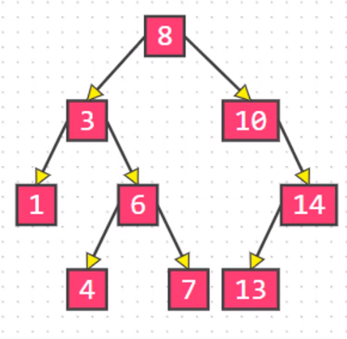

特点：

- 任意一个节点的值都**大于**其**左**子树所有节点的值
- 任意一个节点的值都**小于**其**右**子树所有节点的值
- 它的左右子树也是一棵二叉搜索树

**二叉搜索树可以大大提高搜索数据的效率**

**二叉搜索树存储的元素必须具备可比较性**,如int，double等。如果比较的是自定义类型，需要指定比较的方式。不允许存储的值为null

- #### 二叉搜索树的接口设计


```java
int size(); // 元素的数量
boolean isEmpty();//是否为空
void clear();//清空所有元素
void add(E element);//添加元素
void remove(E element);//删除元素
boolean contains(E element);//是否包含某元素
```

**需要注意的是**

对于我们现在使用的二叉树来说，它的元素是没有索引的概念的，因此不设计

- #### 添加节点

比如往以下二叉树中添加12,1

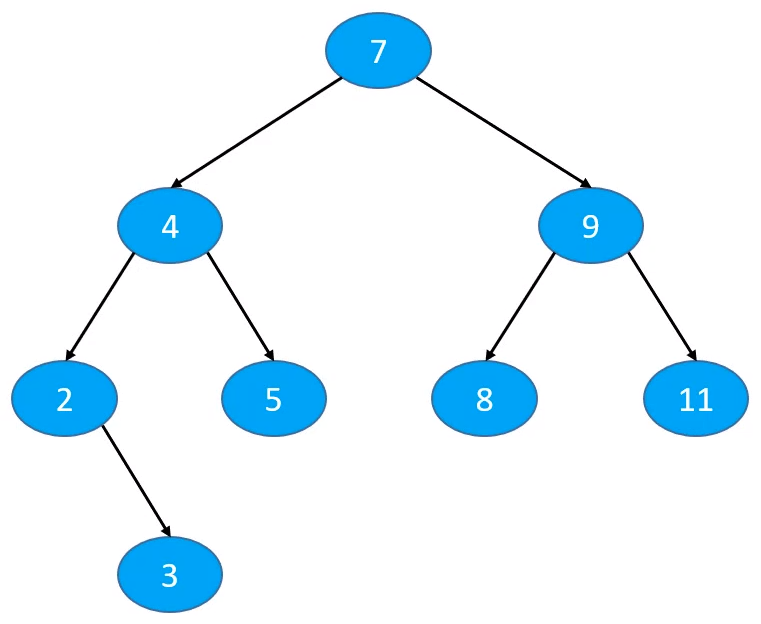

添加12后，二叉树变为

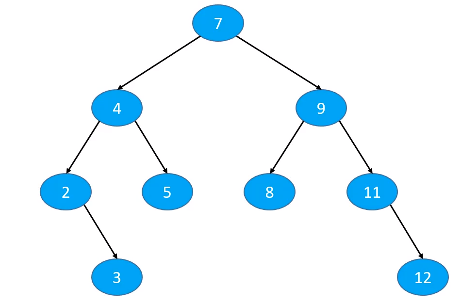

添加1后，二叉树变为

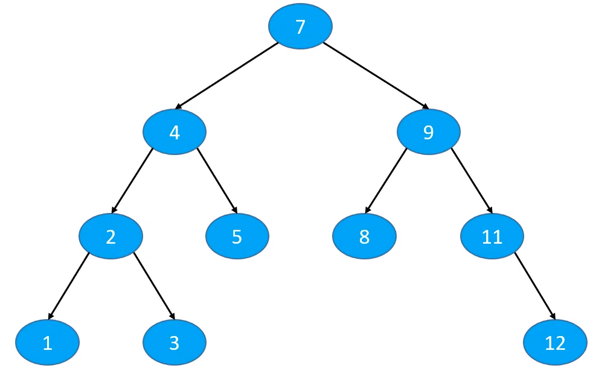

添加步骤：

1.找到父节点parent

2.创建新节点node

3.parent.left = node 或者parent.right = node

遇到相等值的元素该如何处理？

1.建议覆盖旧的值

代码如下：

```java
public void add(E element) {
        elementNotNullCheck(element);
        if (root == null) {
            //添加的第一个节点
            root = new Node<>(element,null);
            size++;
            return;
        }
        //添加的不是第一个节点
        //找到父节点
        Node<E> node = root;
        Node<E> parent = root;
        int cmp = 0;
        while (node != null) {
            cmp = compare(element,node.element);
            parent = node;
            if (cmp > 0) {
                //右节点
                node = node.right;
            } else if (cmp < 0) {
                //左节点
                node = node.left;
            } else  {
                //相等
                return;
            }
        }
        //看看插入到父节点的那个位置
        Node<E> newNode = new Node(element,parent);
        if (cmp > 0) {
            //右边
            parent.right = newNode;
        } else {
            parent.left = newNode;
        }
        size++;
    }
```

如果我们直接通过Integer类型来进行比较的话，我们当中的元素为7,4,9,2,5,8,11,3,12,1时，然后通过工具，打印出来的结果为[具体实现，请查阅源码]

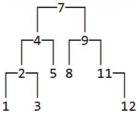

同样的，我们也可以通过自定义的类进行打印，比如我们现在有一个Person的类，其中根据Person的age大小进行比较，我们也可以得出以下比较结果

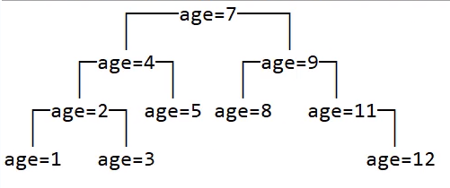

- #### 删除节点

##### 删除叶子节点

假设现在有如下的二叉搜索树

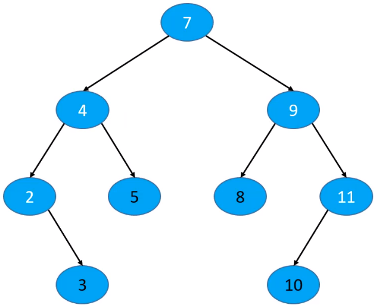

其中，3,5,8,10为叶子节点

> 直接删除

1.如果要删除的节点为左节点，如上图中的8,10，即node == node.parent.left,则我们只需将该节点复制为null即可

node.parent.left = null，意味着连接父节点的线消失，下图

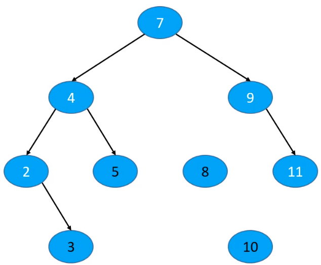

最终节点销毁

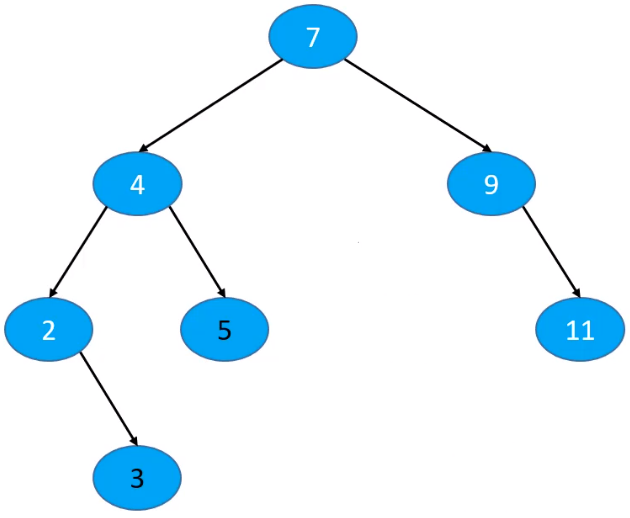

2.如果删除的节点为父节点的右子节点，如上图中的3,5，同样的，我们只需要将父节点中的两个右子节点赋值为空就可以了，即node.parent.right = null，删除后的结果为

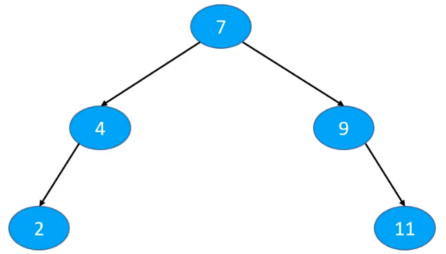

3.还有另外一种情况，即该节点的父节点为空，那么该节点只有一个元素[下图]，我们只需要将该节点赋值为空即可，即root = null

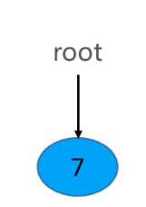

##### 删除度为1的节点

假设现在有如下两棵二叉树

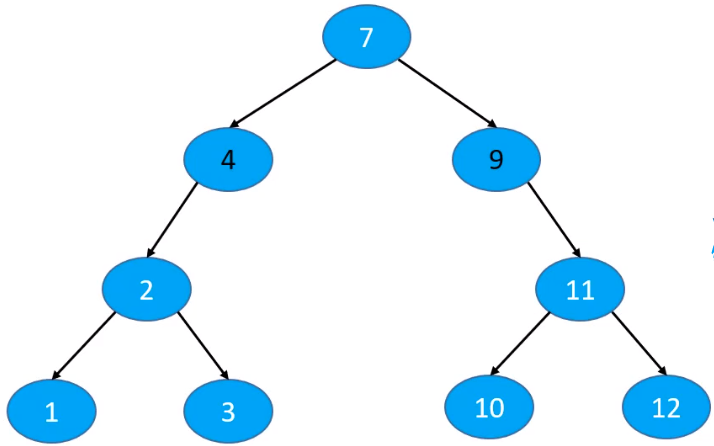

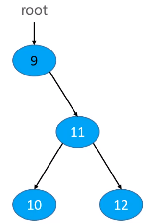

现需要删除两棵树中，度为1的节点，即图一中的4,9与图二中的9

如果需要删除这样的节点，我们只需将**子节点替换原节点**的位置即可，即

- child是node.left或者child是node.right
- 用child（用来替代的节点）替换node（将被删除的节点）的位置
- - 如果node是左子节点
  - child.parent = node.parent
  - node.parent.left = child

图一删除完成后如下图所示

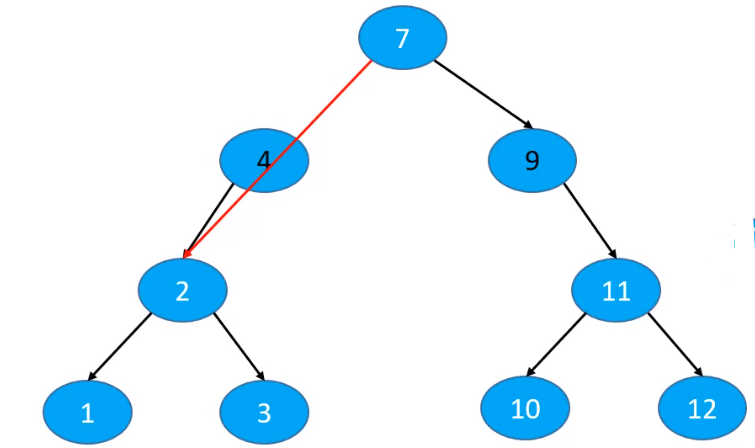

- - 如果node是右子节点
  - child.parent = node.parent
  - node.parent.right = child

图一删除完成后如下图所示

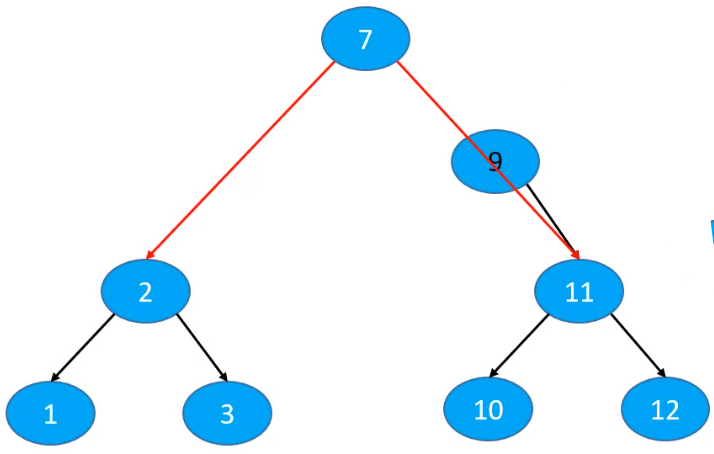

- - 如果node是跟节点，如上图二
  - root = child
  - child.parent = null

图二删除完成后如下图所示

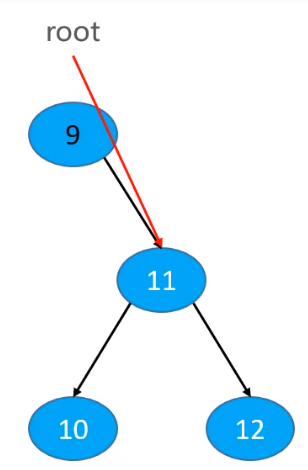

##### 删除度为2的节点

现有如下的二叉搜索树，下图中的5,3,8为度为2的节点

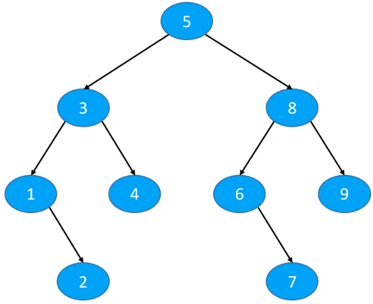

假设现在需要先删除5，再删除4

使用**前驱**或者**后继**节点的值来**覆盖**原节点的值。修改完成后结果为

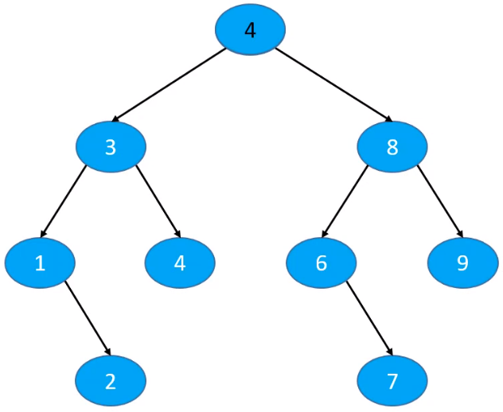

然后**删除**相应的**前驱**或者**后继**节点


现在成功删除5,用同样的方法，删除4即可

> 规律
>
> 如果一个节点的度为2，那么
>
> 它的**前驱**，**后继**节点的度只可能为1或者0，因此在删除度为2的节点时，真正被删除的是度为1或者0的节点

因此二叉搜索树的删除，可通过以下代码实现

```java
public void remove(E element) {
    remove(node(element));
}

private void remove(Node<E> node) {
    if (node == null) return;
    size--;
    //度为2的情况
    if (node.hasTwoChildren()) {
        //找到后继节点
        Node<E> s = successor(node);
        //用后继节点的值，覆盖度为2的节点的值
        node.element = s.element;
        //删除后继节点
        node = s;
    }
    //删除node节点(node的度必然位1或者0)
    Node<E> replacement = node.left != null ? node.left : node.right;
    if (replacement != null) {
        //node是度为1的节点
        //更改parent
        replacement.parent = node.parent;
        //更改parent的left，right的指向
        if (node.parent == null) {
            //node是度为1的节点，并且是根节点
            root = replacement;
        }else if (node == node.parent.left) {
            node.parent.left = replacement;
        } else {
            node.parent.right = replacement;
        }
    } else if (node == root){
        //node是叶子节点.并且是根节点
        root = null;
    } else {
        //node是叶子节点，但不是根节点
        if (node == node.parent.right) {
            node.parent.right = null;
        } else {//node == node.parent.left
            node.parent.left = null;
        }
    }
}

private Node<E> node(E element) {
    Node<E> node = root;
    while (node != null) {
        int cmp = compare(element,node.element);
        if (cmp == 0) return node;
        if (cmp > 0) {
            node = node.right;
        } else  {
            node = node.left;
        }
    }
    return null;
}
```

- #### 代码重构

##### 简单的继承结构

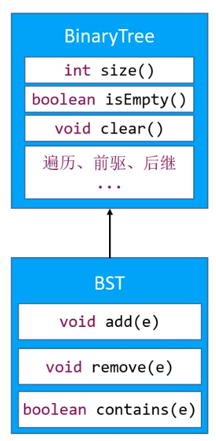

重构代码请参照demo代码中Refactor文件夹中的类