- #### 平衡二叉搜索树

首先，我们对前面介绍的二叉树进行复杂度的分析，假设我们现在按照7,4,9,2,5,8,11的顺序添加节点，那我们的添加顺序应该是这样的

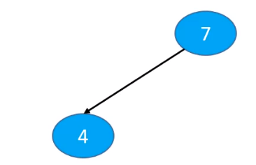

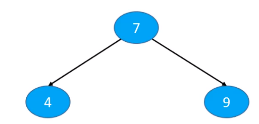

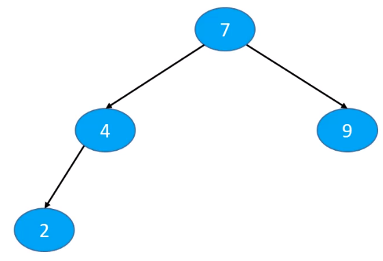

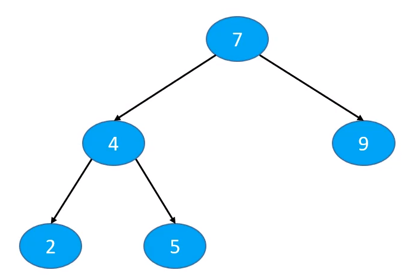

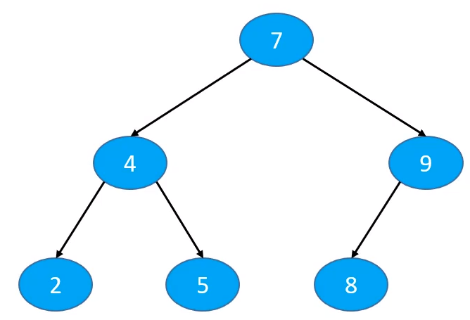

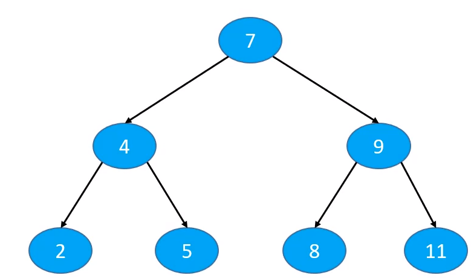

如果我们要对二叉搜索树进行添加删除查找操作，我们是和每一层的元素进行比较，通过比较结果，来确定接下来是和左子树比较还是右子树比较，因此在进行添加删除查找操作时，比较的次数与树的高度有关。因此：**二叉搜索树的添加删除查找操作，复杂度为O(h)**，再由于如果该二叉树是一棵完全二叉树或者满二叉树的话，树的高度为logn，则复杂度为O(logn)

如果在前面添加节点时，是通过从小到大的顺序进行添加的话(即添加顺序为2,4,5,7,8,9,11)，则二叉树的结果为

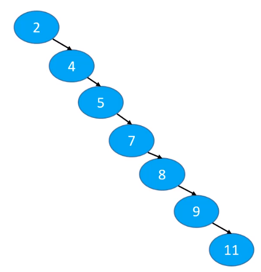

在这种情况下，树的高度就与元素的个数相等了，这是的复杂度为O(h)，即为O(n)，在这种情况下，**二叉搜索树退化成链表**，并且在n比较大时，第一种添加方式和第二种添加方式的性能差距很大，如当n = 1000000时，二叉搜索树的最低高度为20

##### 二叉搜索树退化成链表的另外一种情况

删除节点时也可能会导致二叉搜索树退化成链表，如下面二叉树

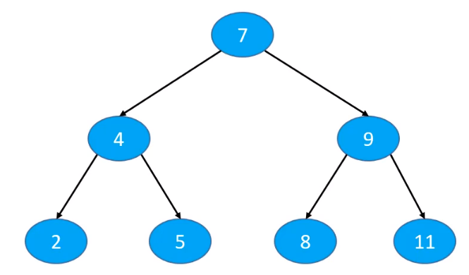

删除掉11后

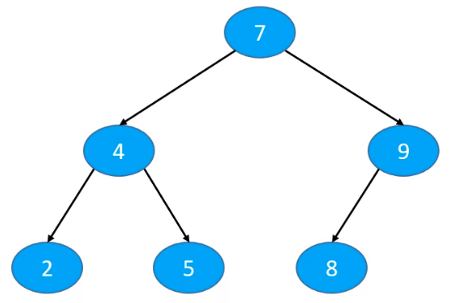

删掉8以后

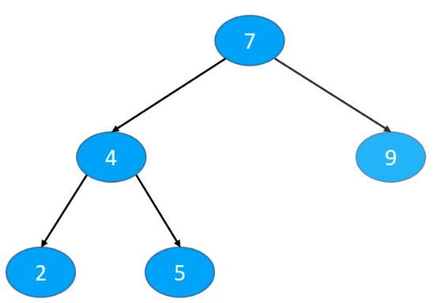

删掉9以后

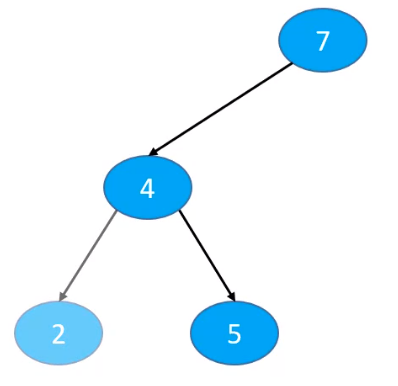

最后删掉2以后

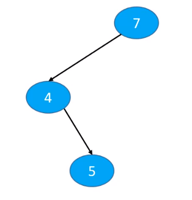

此时，二叉搜索树就退化成了链表

**因此在添加删除节点时，都可能会导致二叉搜索树退化成链表**

因此有没有办法防止二叉搜索树退化成链表？让添加，删除，搜索的复杂度维持在O(logn)

- #### 平衡(Balance)

> 当节点数量固定时，左右子树的高度越接近，这棵二叉树就越平衡。即高度越低

例如下有节点相同的二叉树，可组成不同形状的二叉树

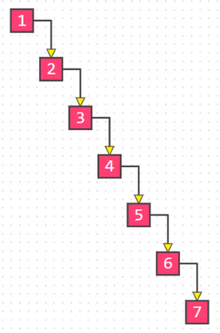

或者组成这样的二叉树

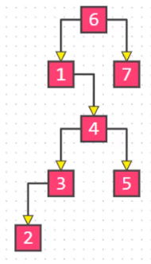

或者组成这样的二叉树

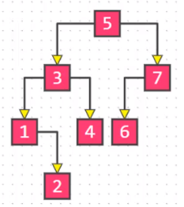

或者组成这样的二叉树

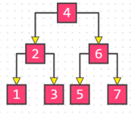

很明显，最后一个二叉树的左右子树是最接近的，通过以上几个不同的二叉树，可以看到，结果是越来越平衡

- #### 理想平衡

> 最理想的平衡，就是想完全二叉树，满二叉树一样，高度是最小的

如下列的两个二叉树

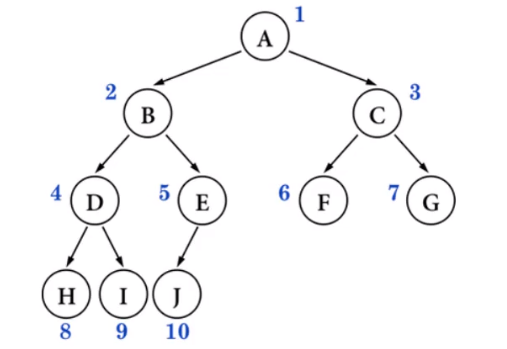

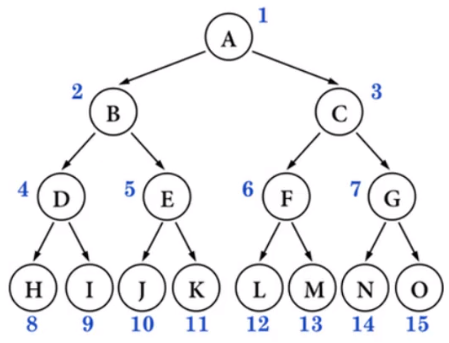

如何改进二叉搜索树

> 首先，节点的添加，删除顺序是无法限制的，可以认为是随机的，所以改进的方案是
>
> - 在节点的添加，删除操作之后，想办法让二叉搜索树恢复平衡，即减小树的高度

例如有下列的二叉搜索树

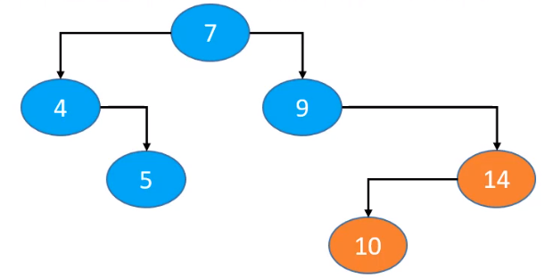

我们往二叉树中添加一个新的节点后，变为

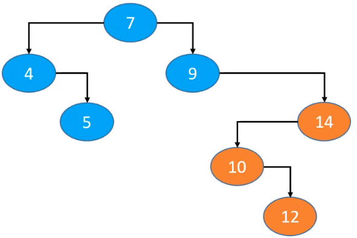

通过这一次添加以后，右子树的高度变为了4，左子树的高度为2

我们可以进行修改节点父子关系的方式，来减小树的高度

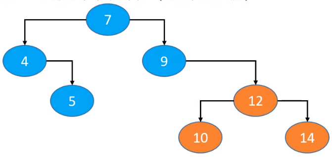

通过调整以后，树的高度减小了1，并且左右子树的高度更加接近，并且调整以后，二叉搜索树的性质依然不变

如果接着继续调整节点的位置，完全可以达到理想平衡，但是付出的代价可能会比较大，比如调整的次数会比较多，反而增加了时间复杂度，因此总结来说，比较合理的改进方案是:**用尽量少的调整次数达到适度平衡即可**。

一棵达到湿度平衡的二叉搜索树，可以成为**平衡二叉搜索树**

- #### 平衡二叉搜索树(Balance Binary Search Tree)

英文简称：BBST

> 经典常见的平衡二叉搜索树有
>
> - AVL树 
>   - 在Windows NT内核中广泛使用
> - 红黑树 
>   - C++ STL 中经常用到，如map,set
>   -  Java的TreeMap，TreeSet，HashMap，HashSet也有使用
>   - Linux的进程调度
>   - Ngix的timer管理

一般也称为:自平衡的二叉搜索树(Self-balancing Binary Search Tree)