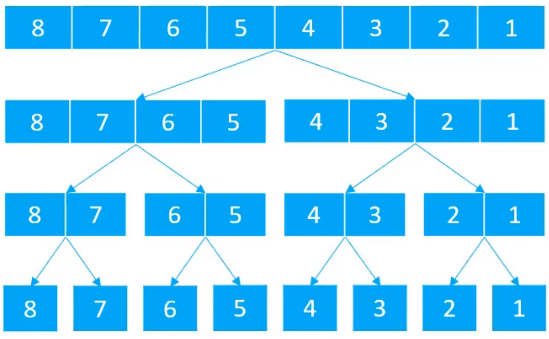
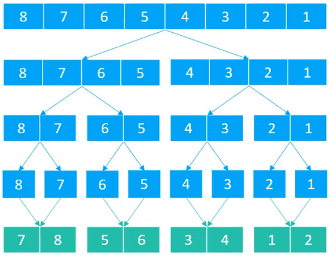
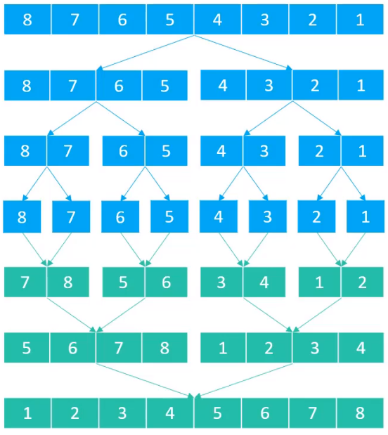
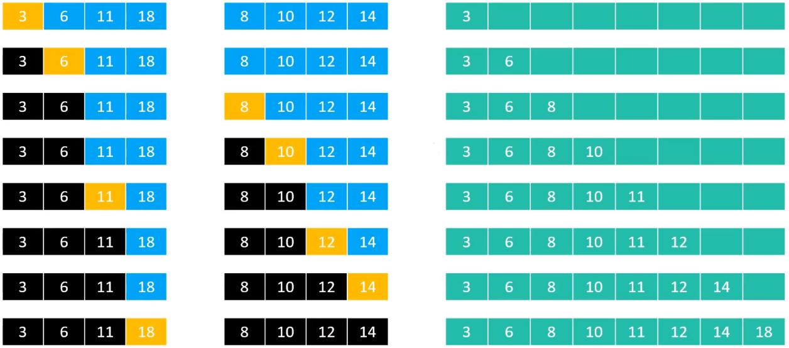
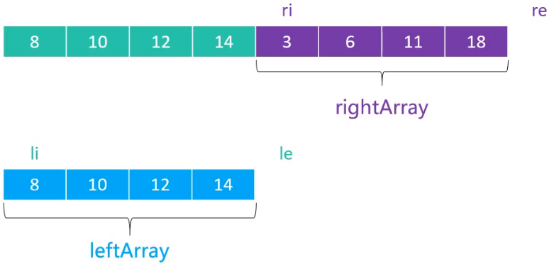
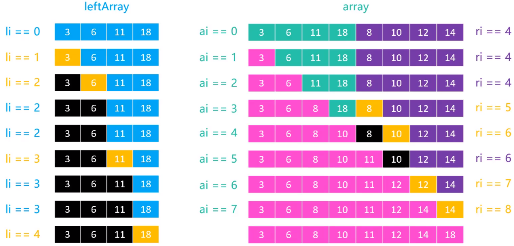
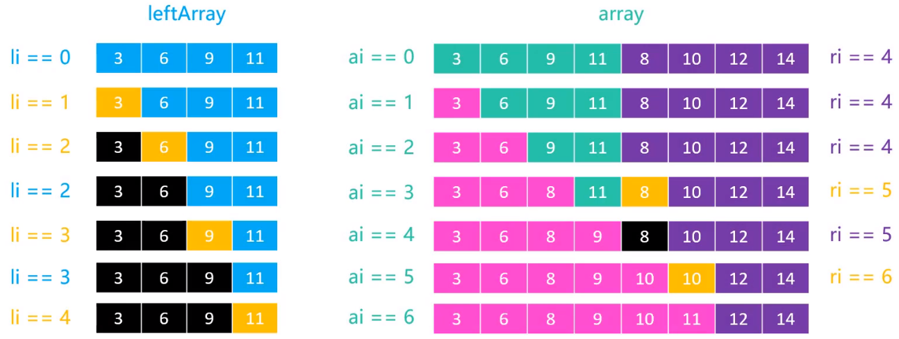
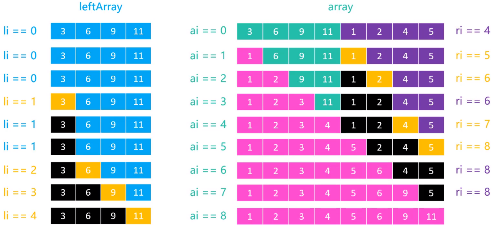
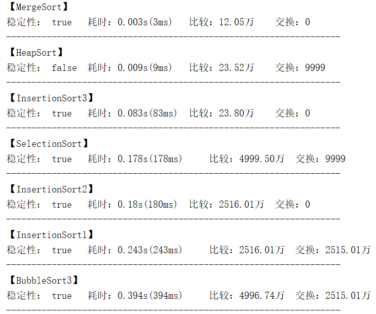

#### 归并排序（Merge Sort）

归并排序是在1945年由约翰·冯·诺依曼首次提出。是的，就是我们经常听说的那位计算机科学家


那归并排序的执行流程是怎么样的呢？

1. 不断地将当前序列平均分割成2个子序列；例如下面的序列，被分割成2个子序列
   
   - 然后继续将这些子序列分割成子序列，知道不能再分割位置（序列中只剩一个元素）
     
2. 接下来，再不断的将两个子序列合并成一个有序序列；也就是说，刚刚是拆分，现在是合并
   
   - 由于是不断的合并成一个有序序列，所以最终只剩下一个有序序列
     

以上就是归并排序的流程。从上面的整个流程可以看出来，归并排序确实是可以将一个序列排好序的。

#### 分割（divide）实现

由于在分割时，都是将一个有序序列分割为2个两个子序列，并且该操作是重复执行的，所以肯定会使用到递归。由于是从中间进行分割，所以需要计算出中间的位置。所以实现流程是

1. 计算拆分的中间位置
2. 分别继续对左边序列和右边序列惊喜拆分

通过该流程，最终得到的代码为

```java
private void divide(int begin, int end) {
    if (end - begin < 2) return;
    int mid = (begin + end) >> 1;
    sort(begin,mid);
    sort(mid,end);
}
```

#### 合并（merge）实现

在merge时，肯定会得到2个有序的数组。所以要做的事情就是将这两个有序的数组合并为一个有序的数组。现有两个有序的数组[下图]，然后根据这两个有序的数组合并为一个。


现在要将这两个有序序列合并为一个更大的有序序列，所以可以先比较两个序列的头元素，谁的值比较小，就先放入大序列中，利用两个索引，分别记录两个序列中待比较值的下标。然后将值小的序列下标右移一个单位，继续比较。最终将两个有序数组合并为一个的流程图如下



所以根据这个流程，发现合并还是非常简单的。那接下来看一下合并中的一些细节

##### merge细节

其实在实际情况下， 需要merge的2组序列是在同一个数组中的，并且是挨在一起的[下图]，并不像上图一样，是三个独立的数组，分别保存在三块独立的内存中


而且最终合并后的有序序列，依然占据的是该块内存。所以，现在就不能像上面这种方式，轻松的将两个序列进行合并了。

所以，为了更好的完成merge操作，最好将其中一组序列备份出来。这里推荐将[begin,mid)部分的元素备份出来，因为在合并时，最先覆盖的是左边的序列。所以原数组与备份后的数组可以通过下图进行表示



其中

> li表示leftindex，其初始值为：0
>
> le表示leftend，其初始值为：mid - begin
>
> ri表示rightindex,其初始值为：mid
>
> re表示rightend,其初始值为：end

##### merge实例

现在定义了以下的两个有序序列，其中将左边的有序序列备份出来到leftArray


并定义了以下的一些变量

> li初始值为0
>
> ri初始值为 4
>
> ai表示当前已覆盖的索引，初始值为0

所以整个合并流程如下



然后，在merge时，不可能两个序列同时合并结束，所以存在左边先结束或者右边先结束。所以需要分情况进行讨论。

###### merge左边先结束

结合上面的merge实例，下面两个序列合并的流程肯定下面这样的



到这里，左边的序列已经提前合并完了。由于右边的元素本来就在右边，所以不用做任何操作，整个合并就结束了

###### merge右边先结束

同样结合merge实例，下列的两个序列合并是这样的


到这一步，发现右边序列中的所有元素都已经移动到了对应的位置，剩下左边的元素，一次移动到主序列中就可以了，所以全部合并流程如下图



###### 总结

- 如果左边提前结束
  不用做任何操作，因为右边的元素本来就已经就位
- 如果是右边的提前结束
  不断进行li++,ai++,将左边的元素移动到主序列中

根据上面的分析，最终merge可以这样进行实现

```java
private void merge(int begin, int mid, int end){
    int li = 0, le = mid - begin;
    int ri = mid, re = end;
    int ai = begin;
    //现将左边的数据备份
    for (int i = li; i < le; i++) {
        leftArray[i] = array[begin +i];
    }

    //merge操作
    while (li < le) {
        //左边还没结束
        if (ri < re && cmp(array[ri],leftArray[li]) < 0) {
            array[ai++] = array[ri++];
        } else {
            array[ai++] = leftArray[li++];
        }
    }
}
```

然后将程序运行后，得到几个排序算法的最终结果



可以发现，MergeSort的排序算法非常的优秀，遥遥领先与前面算法中一直领先的HeapSort算法。并且MergeSort不仅性能高，并且是一个稳定的排序算法。

#### 复杂度分析

关于MergeSort的复杂度，其实是不太好进行分析的，因为涉及到divide的递归调用，并且在divide中还有调用merge函数，这种情况下，就可以考虑递推的公式来计算。

假设和MergeSort所花费的时间为T(n)，则divide函数中递归调用的两个divide所花费的时间为T(n/2)，merge函数可以估算，其结果为O(n)，所以又以下的等式

T(n) = 2 * T(n/2) + O(n)

当只有一个元素时，

T(1) = O(1)

现在对T(n) = 2 * T(n/2) + O(n)进行左右 / n的操作，得到的结果如下

T(n) / n = (n / 2) * T(n/2) + O(1)

现在令S(n) = T(n)/n，则S(1) = O(1)，然后利用表达式带入

S(n) = S(n/2) + O(1) 

请问现在S(n/2)等于多少？现在S(n/2) = S(n/4) + O(1)，S(n/4) = S(n/8) + O(1)

所以最终S(n) = S(n/2) + O(1)  = S(n/4) + O(2) = S(n/8) + O(3) = S(n/2^k) + O(k) = S(1) + O(logn) = O(logn)

所以T(n) = n * log(n) = nlogn

所以时间复杂度为O(nlogn)

由于归并排序总数平均分割子序列，所以最好/最坏/平均时间复杂度都是O(nlogn)，属于稳定的排序算法

并且从代码中不难看出，归并排序的空间复杂度是O(n/2 + logn) = O(n) 

##### 常见的递推式与复杂度

|           递推式           |  复杂度  |
| :------------------------: | :------: |
|    T(n) = T(n/2) + O(1)    | O(logn)  |
|   T(n) = T(n - 1) + O(1)   |   O(n)   |
|    T(n) = T(n/2) + O(n)    |   O(n)   |
|  T(n) = 2 * T(n/2) + O(1)  |   O(n)   |
|  T(n) = 2 * T(n/2) + O(n)  | O(nlogn) |
|   T(n) = T(n - 1) + O(n)   |  O(n^2)  |
| T(n) = 2 * T(n - 1) + O(1) |  O(2^n)  |
| T(n) = 2 * T(n - 1) + O(n) |  O(2^n)  |

