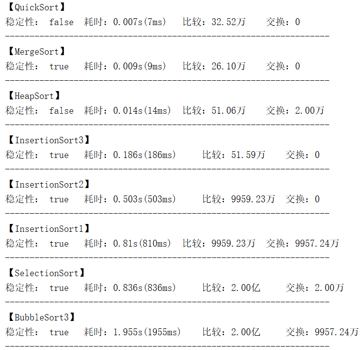
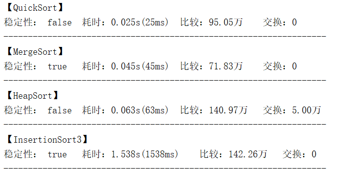
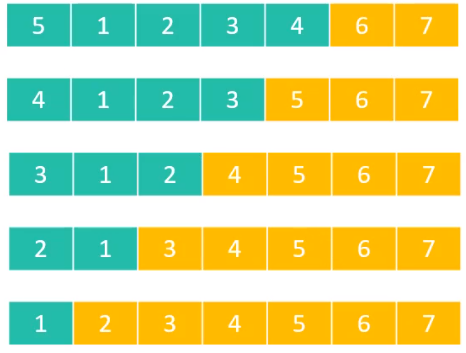
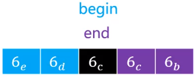
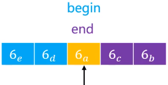
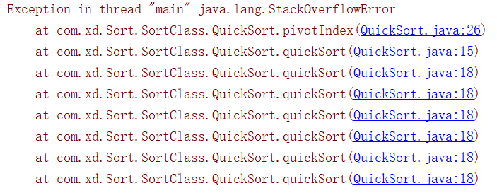

#### 快速排序（Quick Sort）

看到名字，就知道这种排序算法速度非常快。那到底有多快呢？在前面[冒泡排序](https://github.com/MSTGit/Algorithm/tree/master/AdvancedPart/01-BobbleSort)时，就有提到过这种排序算法，它的平均时间复杂度为O(nlogn)，但看到其最坏时间复杂度为O(n^2)，不过，虽然有最坏的情况，但是还是有办法降低最坏情况出现的概率，所以总体来讲，效率还是非常高的。但是在前面也介绍过，堆排序与归并排序，其时间复杂度都是O(nlogn)级别的，但是这三个O(nlogn)级别的排序算法，哪个算法会更快呢？其实快速排序会更加快，也就是说，在本章节介绍的快速排序会比对排序与归并排序速度更快。

##### 快速排序简介

快速排序是1960年由查尔斯·安东尼·理查德·霍尔(Charles Antony Richard Hoare)，一般称为东尼·霍尔（Tony Hoare）


其实结合前面的归并排序介绍，可以发现一个特点，现在的排序算法都是几十年前的结论，也就是说，几十年过去了，到现在还没有一个稳定的，被大家公认的排序算法来替代这些优秀的算法，还望大家来突破这些算法。

##### 快速排序执行流程

1. 从序列中选择一个轴点元素（pivot）

   - 假设每次选择0位置的元素为轴点元素，例如下图的序列

     现在选择0位置的元素6作为轴点元素，一旦定义好了轴点元素后，就开始执行步骤2

2. 利用轴点元素将序列分割成2个子序列

   - 将小于轴点元素的元素放在轴点元素的前面（左侧）
   - 将大于轴点元素的元素放在轴点元素的后面（右侧）
   - 等于轴点元素的元素放任意一边都可以

   所以利用上图的序列，进行分割以后，就会变为下图的这样一个序列，通过这样分割，相对于原来的序列，会变得更加有序一点

   

3. 对子序列进行1,2操作

   - 知道不能再分割（子序列中只剩下一个元素）

   所以对上面的序列再次执行1,2操作的话，最终得到的结果如下图

   

   再次执行1,2操作，得到下图的结果

   

最终，将所有元素一次排好序。

所以可以发现，快速排序的本质是

> 逐渐将每一个元素都转换成轴点元素，当所有元素都变为轴点元素时，就拍好序了

那这个流程应该怎样去实现呢？

#### 构造轴点

假设现在有下列的序列，这个序列有点特殊，其中有两个6，两个8，为了表示区分，方别用6a/6b，8a/8b来表示，其中begin指向首元素，end指向末尾元素（这里的end和前面章节的end指向的位置有一点区别）


现在希望将6a变为轴点，一般会先将该元素进行备份，利用一个临时的变量，将该值保存起来。


由于现在是begin有空的位置，所以从end到begin+1开始扫描元素，在本序列中，首先扫描到的是7，由于7大于轴点元素，所以只需要将end--即可，继续扫描


现在扫描到的是5，由于5是小于轴点元素，所以应该放到序列的左边。然后begin++


现在空的位置变为end方向，所以扫描的防线变为从begin到end的方向。扫描到的第一个元素是8a，由于8a是比轴点元素大的，所以将8a的值直接覆盖end指向的位置，然后将end--


由于现在空位置是由begin直接指向的，所以本次扫描方向由end方向到begin方向，继续扫描，这次扫描发现元素为9，比轴点元素大，所以只需要将end--即可


由于空位置没有发生变化，所以继续从end扫描到begin，本次扫描到的元素为4，其值比轴点元素小，所以将元素4直接覆盖掉begin指向的位置，然后begin++


现在空位置是右end指针指向，所以扫描方向发生变化，变为从begin扫描到end，由于本次扫描到的元素为8b，值比轴点元素大，所以将8b的值覆盖掉end指针指向的位置，然后进行end--操作


完成后，空的位置现在有begin指针指向，所以扫描方向变为end到begin方向，本次扫描到的元素是6b，是等于轴点元素的，由于等于轴点元素的元素，放轴点元素任意一边都可以，所以直接end--就行，不过这里执行的操作是将相等的元素放到另外一边，所以这里是将end蚊子相等的元素放在begin，begin++，最终的效果如下图


现在空的位置由end指向，所以扫描方向由begin到end方向。不过这次扫描发现值比轴点元素小，所以直接begin++就可以了，begin++后得到的begin等于end，一旦发现begin和end重叠，就意味着轴点元素构建完毕


由于之前备份了6a的值，所以现在要做的事情是将6a的值，覆盖当前空出来的位置，这样6a就归位了


所以最终发现，6a变为轴点后，最终找到了自己的位置，并且轴点构建完毕。

轴点构建总结：扫描方向主要看空出来的位置是由begin指向还是有end指向

- 如果end指向空出来的元素， 则从begin扫描到end
- 如果是begin指向空出来的元素，则从end扫描到begin

根据上面的分析，最终可以得到获取轴点的实现代码如下

```java
/*
* 构造出[begin,end)范围内的轴点元素
* @return 轴点元素的最终位置
* */
private int pivotIndex(int begin, int end) {
    //备份轴点元素
    E pivot = array[begin];
    //end指向最后一个元素
    end--;
    while (begin < end) {
        while (begin < end) {
            if (cmp(pivot,array[end]) < 0) {//右边元素大于轴点元素
                end--;
            } else  {//右边元素小于等于轴点元素
                array[begin++] = array[end];
                break;
            }
        }
        while (begin < end) {
            if (cmp(pivot,array[begin]) >0) {//左边元素小于轴点
                begin++;
            } else {//左边元素大于等于轴点元素
                array[end--] = array[begin];
                break;
            }
        }
    }
    //将轴点元素放入最终的位置
    array[begin] = pivot;
    //返回轴点元素的位置
    return begin;
}
```

然后利用获取到的轴点，对begin到end范围内的元素进行快速排序的代码

```java
/*
* 对[begin,end)范围内的元素进行快速排序
* */
private void quickSort(int begin, int end) {
    if (end - begin < 2) return;
    //确定轴点位置
    int mid = pivotIndex(begin,end);
    //对子序列也进行快速排序
    quickSort(begin,mid);//左边子序列快速排序
    quickSort(mid + 1 ,end);//右边子序列快速排序
}
```

利用上面代码，结合前面的几种排序算法，对20000条数据进行排序的结果如下图



可以看到，快速排序与前面几种排序结果排序后，得到的结果非常优秀。如果再将数据进行增加到50000条数据，得到的结果就更加明显了，结果如下（这里的排序，对前面性能较差的几种排序就不再做对比了）



#### 时间复杂度分析

在轴点左右元素数量比较均匀的情况下，是快速排序性能最佳的时候。

在这个时候，可以得到所消耗时间的表达式为：T(n) = 2 * T(n/2) + O(n)

可以看到，这个表达式与归并排序的表达式是一样的，所以在最好的情况下， 快速排序的时间复杂度与归并排序的时间复杂度相同，都是O(nlogn)

如果轴点左右两边元素数量及其不均匀，则是时间复杂度最坏的情况。

例如现在有如下的序列


将元素7作为轴点，轴点构造完成后的结果为


并往复执行构造轴点，最终得到的每一步结果为



所以在这个时候，就是最坏时间复杂度的时候。在这种情况下，所消耗时间的表达式为：T(n) = T(n-1) + O(n) = O(n^2)；

##### 避免最坏情况

为了降低最坏情况的出现概率，一般采取的做法是

1. 随机选择轴点元素

所以优化后的代码为

```java
private int pivotIndex(int begin, int end) {
    //随机选择一个元素跟begin位置进行交换
    swap(begin,(int)(Math.random() * (end - begin)) + begin);
    //备份轴点元素
    E pivot = array[begin];
    //end指向最后一个元素
    end--;
    while (begin < end) {
        while (begin < end) {
            if (cmp(pivot,array[end]) < 0) {//右边元素大于轴点元素
                end--;
            } else  {//右边元素小于等于轴点元素
                array[begin++] = array[end];
                break;
            }
        }
        while (begin < end) {
            if (cmp(pivot,array[begin]) >0) {//左边元素小于轴点
                begin++;
            } else {//左边元素大于等于轴点元素
                array[end--] = array[begin];
                break;
            }
        }
    }
    //将轴点元素放入最终的位置
    array[begin] = pivot;
    //返回轴点元素的位置
    return begin;
}
```

快速排序时间复杂度总结：

> 最好，平均时间复杂度为：O(nlogn)
>
> 最坏时间复杂度：O(n^2)
>
> 空间复杂度：O(logn)

#### 与轴点相等的元素

在前面，如果遇到轴点元素相等的元素，都是直接将该元素放到轴点元素的另一边。具体是怎么做的呢？请看下图，现在所有元素都是相等的

1. 备份轴点元素
   
2. 执行第一次确定元素位置，发现值是相等的，这时，原来轴点右边的元素，被放到了轴点的左边
   
3. 执行第二次确定元素位置，发现值是相等的，这时，将原来轴点左边的元素，被放到轴点的右边
   
4. 执行第三次确定元素位置,发现值是相等的，这时，原来轴点右边的元素，被放到了轴点的左边
   
5. 执行第四次确定元素位置，发现值是相等的，这时，将原来轴点左边的元素，被放到轴点的右边
   
6. 将备份的元素放到begin与end重合的位置
   

发现，如果用原来的这种确定轴点的方式，有一个好处就是，轴点确定以后，依然可以平均分割原来的序列。

所以在pivot与end元素进行比较时，不是≤或者≥的原因是为了提高性能，避免出现最坏时间复杂度的情况。

如果将cmp位置的判断分别改为≤，≥会起到什么效果呢？

这样进行判断，会导致轴点元素切割出来的序列，非常不均匀，可能会导致最坏时间复杂度O(n^2)

为了进行对比，现生成5万条相等的数据，利用原来的算法进行测试，得到的结果如下图


现在将判断条件分别改为≤，≥，得到的结果如下图



最终控制台打印出了非常多的这种信息，从提示信息可以看出，是发生了栈溢出，也就是说栈空间消耗完了，原因是现在的轴点切割非常不均匀，每次切割只会减少一个数据规模，也就意味着quickSort函数会递归调用n次，在当前程序中，是要递归调用5万次，需要开辟5万次栈空间，最终导致栈空间不够用。

所以为了对比出最终的效果，现在将数据规模调整到1万条。在不加＝的情况下，得到的结果为


加上＝后的结果为


可以看到，最终的比较结果，差距非常大。所以在进行比较判断的时候，不要使用≥或者≤