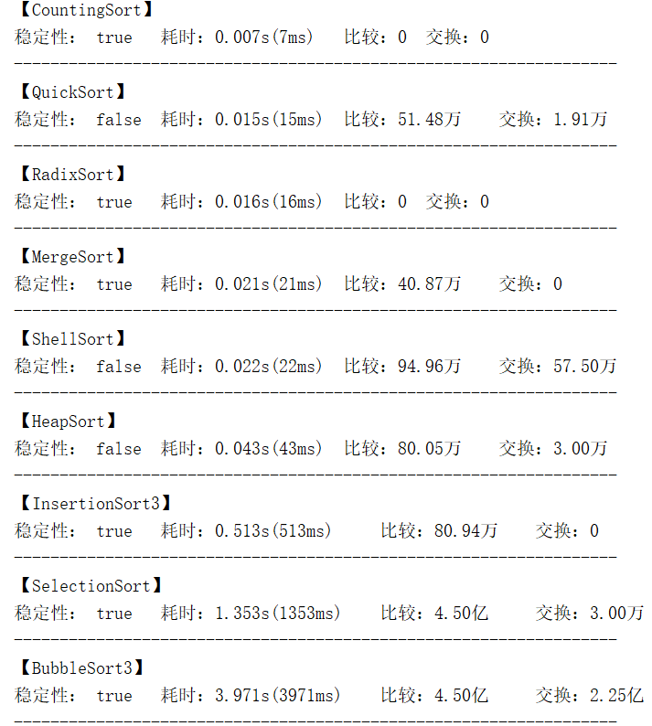

#### 基数排序（Radix Sort）

基数排序非常适合用于整数排序（尤其是非负整数），所以在本节内容中，只演示对非负整数进行基数排序，因为如果是负数或者是小数，就会非常麻烦，有兴趣的读者，也可以自己研究负数或者小数的基数排序。

接下来就来了解以下基数排序的执行流程

**依次对个位数，十位数，百位数，千位数，万位数...进行排序（从低位到高位）**

看起来非常神奇，这样就能把一堆数据排序了吗？可以看下面的示例，有一堆如下图所示的整数


经过第一轮，对个位数进行排序后的结果如下


第一轮排完序以后，再对十位数进行排序，如果没有十位数的元素，把十位数当做0来处理，排序后的结果如下


再对百位数进行排序，没有百位数的，也当做百位数为0进行处理，排序的结果为


通过这样，就将上面的序列排好序了。不过请大家注意，不能先对高位数进行排序，再对低位数进行排序。

再仔细观察可以发现，在每一轮进行排序时，实际上是对整数范围内0-9的元素进行排序。所以说到这里，你肯定想到了，每一轮的排序可以利用上一节介绍的计数排序来实现。接下来，就将上面的代码进行实现。

```java
protected void sort() {
    //找出最大值
    int max = array[0];
    for (int i = 1; i < array.length; i++) {
        if (array[i] > max) {
            max = array[i];
        }
    }
    for (int devider = 1; devider <= max ; devider *= 10) {
        countingSort(devider);
    }
}

protected void countingSort(int devider) {
    int[] counts = new int[10];
    for (int i = 0; i < array.length; i++) {
        counts[array[i] / devider % 10]++;
    }
    // 累加次数
    for (int i = 1; i < counts.length; i++) {
        counts[i] += counts[i - 1];
    }

    int[] newArray = new int[array.length];
    for (int i = array.length - 1; i >= 0; i--) {
        newArray[--counts[array[i] / devider % 10]] = array[i];
    }

    for (int i = 0; i < newArray.length; i++) {
        array[i] = newArray[i];
    }
}
```

利用相同的元素，与前面介绍的几种排序算法进行比较，最终得到的结果如下



可以看到，基数排序表现依然非常优秀。

#### 时间复杂度分析

> 最好，最坏，平均时间复杂度：O(d*(n+k))，d是最大值的个位数，k是进制，并且属于稳定的排序算法
>
> 空间复杂度：O(n+k)

#### 另外一种思路

同样是上面的数组序列

