# 1. 题目1 [删除链表中的节点]( https://leetcode-cn.com/problems/delete-node-in-a-linked-list/ )

方法：**与下一个节点交换**
从链表里删除一个节点 node 的最常见方法是修改之前节点的 next 指针，使其指向之后的节点。

因为，我们无法访问我们想要删除的节点 之前 的节点，我们始终不能修改该节点的 next 指针。相反，我们必须将想要删除的节点的值替换为它后面节点中的值，然后删除它之后的节点。

因为我们知道要删除的节点不是列表的末尾，所以我们可以保证这种方法是可行的。

```java
public void deleteNode(ListNode node) {
    node.val = node.next.val;
    node.next = node.next.next;
}
```


# 2. 题目2 [反转一个链表]( https://leetcode-cn.com/problems/reverse-linked-list/solution/fan-zhuan-lian-biao-by-leetcode/ )

## 2.1 方法一 通过递归的方式实现

该题目中的链表，通过图形表示如下

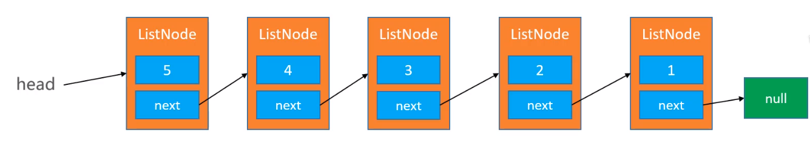

然后通过函数，将链表反转后的结果表示为如下

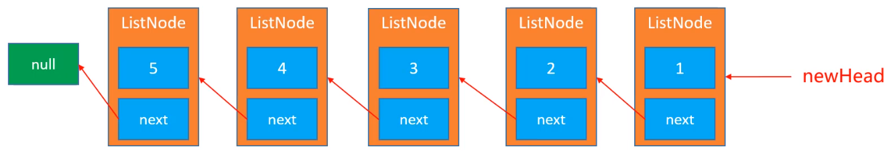

解决方法

假设有如下所示的链表，5 > 4 > 3 > 2 > 1 （图中省略3 > 2 > 1）

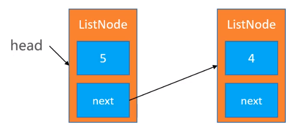

我们定义函数reverseList(ListNode node)，反转上图中的head.next（即：ListNode newHead = reverseList(head.next)），则newHead的表示结果为（其实就是将4传进去，反转后的结果应该为1 > 2 > 3 > 4 > null）

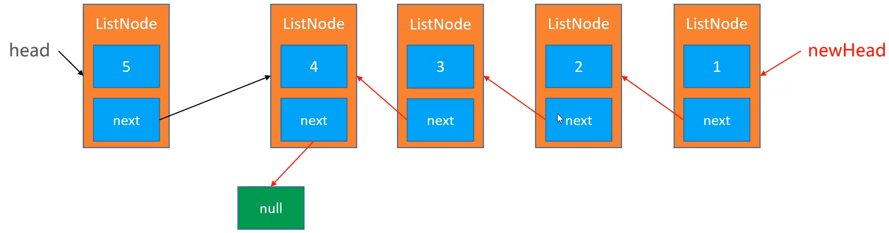

那么同理，我们将3传进去，反转后的结果为1 > 2 > 3 > null

...

接下来需要做的就是将上图4的next指向5，通过代码表示即为head.next.next = head；

最后需要做的就是5的next应该指向null，通过代码表示即为 head.next = null;


```java
class Solution {
    public ListNode reverseList(ListNode head) {
        if (head == null || head.next == null) {
            return head;
        }
        ListNode p = reverseList(head.next);
        head.next.next = head;
        head.next = null;
        return p;
    }
}
```


## 2.2 方法二 通过非递归的方式实现

同样的，我们一开始的时候，链表如下所示

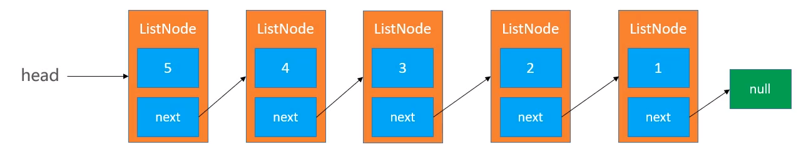

我们的希望是传入一个新节点，然后最终返回的结果是1 > 2 > 3 > 4 > 5 > null

我们假设有下面一个newHead链表

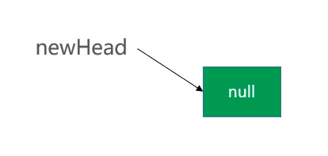

由于我们现在能拿到的是head,那么我们可以先将先用一个临时变量，将head节点先保存起来后，再修改head中的next指向newHead指向的节点，然后将newHead指向head指向的节点，再然后将head指向head（5的节点）的next节点，结束后就将head(5的节点)，成功的重原来的链表中取了出来，最终的结果为

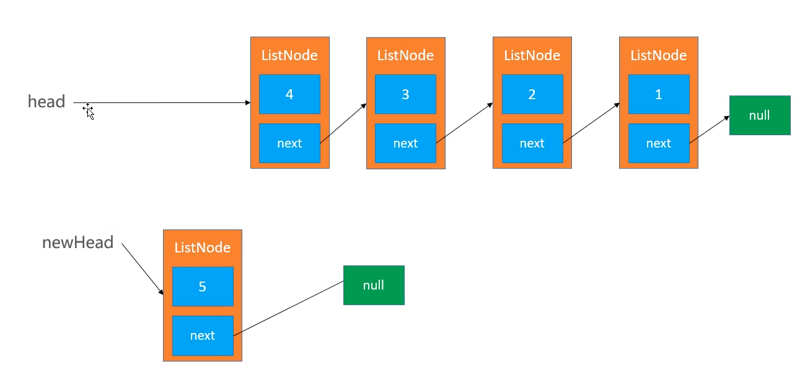

然后再次重复上面的步骤，先将head(4的节点)的next指向newHead所指向的节点，newHead指向head(4的节点)所指向的节点，再然后将head指向的head(4的节点)的next节点

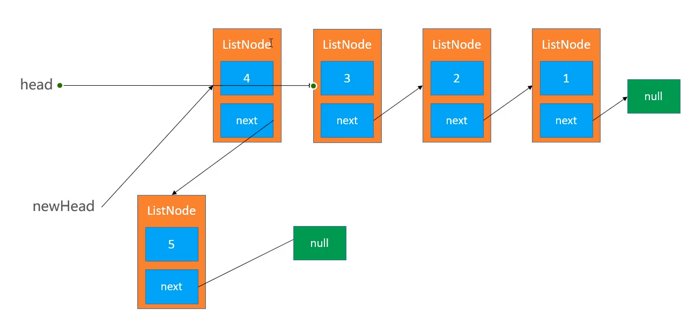

最终4成功的从原来的链表中取出来了

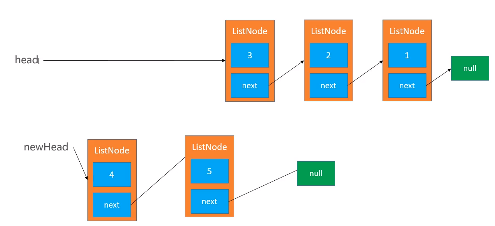

如此重复操作，就可以成功的将原来的所有节点，重新串起来,链表反转成功。demo源码地址


```java
class Solution {
    public ListNode reverseList(ListNode head) {
        ListNode prev = null;
        ListNode curr = head;
        while (curr != null) {
            ListNode nextTemp = curr.next;
            curr.next = prev;
            prev = curr;
            curr = nextTemp;
        }
        return prev;
    }
}
```


# 3. 题目3 [判断一个链表是否有环]( https://leetcode-cn.com/problems/linked-list-cycle/ )

假设有如下链表

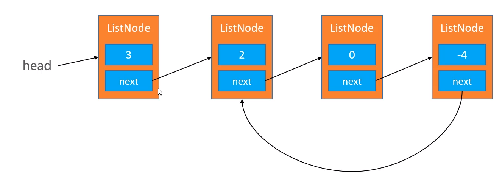

我们可以先定义一个slow指针，假设指向head节点

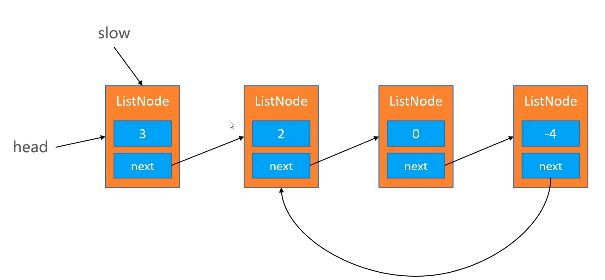

然后再定义一个fast指针，假设指向第二个节点

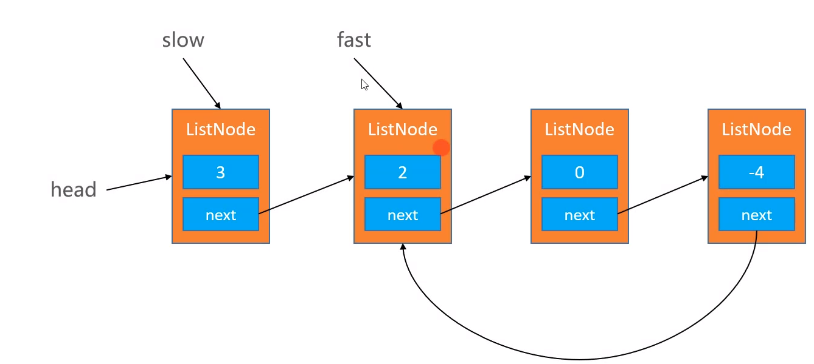

其中规定，slow指针，一次走一步，即下一次指向元素为2的节点，fast指针一次走两步，即下一次指向元素为4的节点。走到一定程度后，大家都会进入链表的环中，多次重复后，slow指针和fast指针最终肯定会相遇，进入环后，我们可以理解为再两个速度不相等的人再围着操场的跑道跑步，最终会相遇

```java
public class Solution {
    public boolean hasCycle(ListNode head) {
        if (head == null || head.next == null) {
            return false;
        }
        ListNode slow = head;
        ListNode fast = head.next;
        while (slow != fast) {
            if (fast == null || fast.next == null) {
                return false;
            }
            slow = slow.next;
            fast = fast.next.next;
        }
        return true;
    }
}
```

